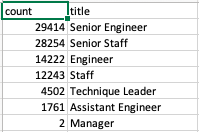

# Hackard_Pewlett_Analysis

## Overview
Hackard Pewlett is preparing for a “silver tsunami” as many current employees reach retirement age. To prepare for this change, the number of retiring employees per title and the employees eligible to participate in a mentorship program were determined.

## Results
The number of retiring employees by title are as follows:

The employees eligible for the mentorship program are listed as follows:

Complete list here: Data/mentorship_eligibilty.csv

## Summary
The number of retiring employees are 90,398 and the number employees eligible for mentorship are 1,549. So while the mentorship program is a good option for recruitment, Hackard Pewlett will need to find more solutions for the impending "silver tsunami."